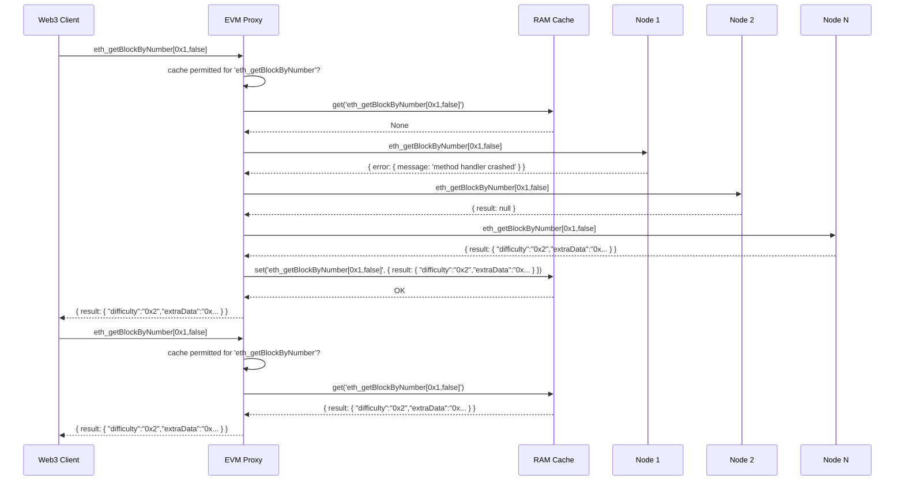

# EVM Proxy

JSON RPC 2.0 caching proxy (and simple balancer) for blockchain nodes (geth, Erigon, Solana, etc..). Running proxy is to be used instead of Web3 HTTP URL of real node in Web3 client library. In case of abscence of the data for given block in the particular node or some recoverable error instead of returning ```{ ..., result: null }``` proxy will try over and over again for every available upstream.

### Features

* Written on Rust with Tokio async library and Actix Web server. High speed data processing and low memory footprint. Could be compilled as standalone executable with no external dependencies
* Handling of node's recoverable errors (no data for particular block in the particular node) with requerying from next available upstream
* In-memory caching of all requests with automatic cache cleaning in terms of time to live and maximum cache capacity
* Preventing some methods from caching
* Maintain optional rate limits relevant to every upstream

### Flow Chart



## Installation

### Rust

```bash
curl --proto '=https' --tlsv1.2 -sSf https://sh.rustup.rs | sh
```

### Clone Repository

```bash
git pull git@github.com:DirectX/evm-proxy.git
cd evm-proxy
```

### Copy Example Configs

```bash
cp config.example.yaml config.yaml
cp .env.example .env # optional, only to elevate log level if necessary
```

### Edit config.yaml

```yaml
server:
  host: 127.0.0.1
  port: 8000
cache:
  enabled: true
  exclude_methods:
    "eth_syncing": true
    "eth_blockNumber": true
upstreams:
  - http_url: http://localhost:8545
    ...
  - http_url: https://bsc-dataseed1.binance.org/
    rate_limit: 10K / 5 m
    failover: true
try_next_upstream_on_errors:
  "method handler crashed": true
```

Cache as of now could be either on (true) and off (false). TTL and capacity tuning TBD.

Marking last upstream with ```failover: true``` means that this upstream will wait for response if rate limits was exceeded. If upstream not marked as failover and runs out of rate limits next upstream will be requested immediately if available.

```try_next_upstream_on_errors``` is an example of internal error which assumes local node problem possibly recoverable using another upstream node request with the same params. This could be extended with other application-specific recoverable errors.

#### Rate limits examples

* 10 / 1 (implies 10 / 1 s)
* 1 / 1 s
* 10 / 1 s
* 10K / 5 m
* 100K / 24 h

### Run

```bash
cargo run
```

### Check

```bash
curl --data '{"jsonrpc":"2.0","id":1,"method":"eth_getBlockByNumber","params":["0x1406f40",false]}' -H "Content-Type: application/json" http://localhost:8000
```

### Release build

```bash
cargo build --release
```

Binary will be placed in ```./target/release/evm-proxy```